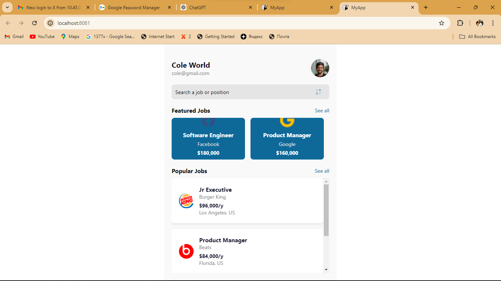
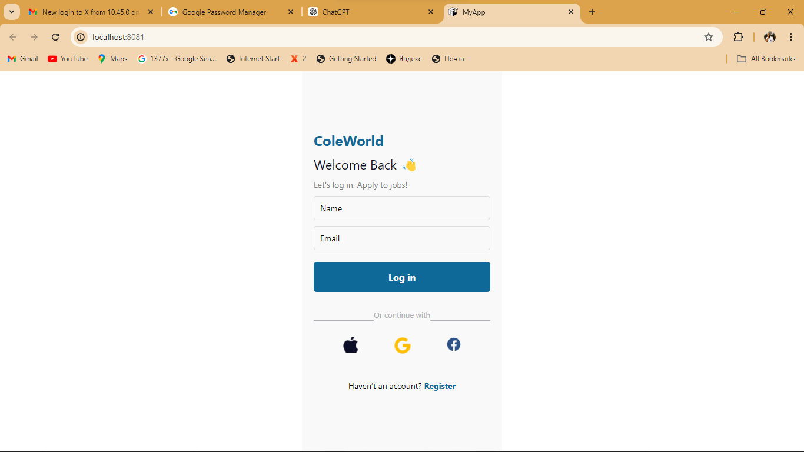

Upon opening the app, users are greeted with a personalized experience. They can log in using their name and email or choose a quick login option through popular social media platforms such as Apple, Google, or Facebook. This ensures a hassle-free entry into the job search process, tailored to their preferences and history.
The app prominently features a curated list of top job openings from leading companies like Facebook and Google. Each listing showcases essential details including job title, hiring company, location, and competitive salary information. Users can easily swipe through these featured jobs, getting a quick overview of enticing career opportunities.
To streamline the job search process, our app includes robust search functionality. Users can enter keywords related to specific job titles or industries, quickly narrowing down their options to find the perfect match. Additionally, a built-in filter feature allows users to refine their search based on location, salary range, or other relevant criteria, ensuring that they find jobs that align with their preferences.